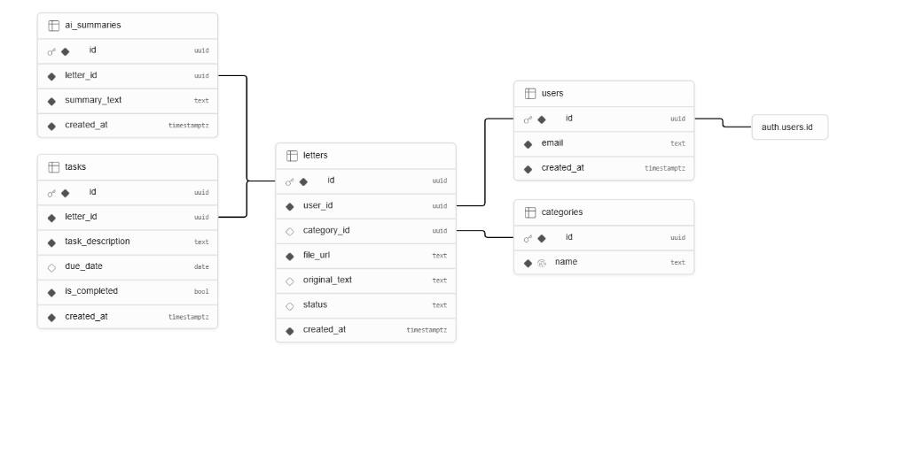

# BuroBuddy 📬

> The Smart Assistant for Bureaucratic Mail

🌐 **Live App:** [https://buro-buddy.vercel.app](https://buro-buddy.vercel.app)  
📁 **GitHub:** [https://github.com/orly-get/Buro_buddy](https://github.com/orly-get/Buro_buddy)

---

## The Problem We Solve

Official letters from government agencies, banks, and municipalities are written in complex legal language that is hard to understand. People miss deadlines, misunderstand what is required, and sometimes face fines as a result. BuroBuddy solves this: upload a photo of the letter and get a plain-language summary with a clear action list.

## Target Audience

Israeli citizens — especially young adults and non-native Hebrew speakers — who struggle to understand official mail and risk missing important deadlines.

## How We Stand Out

| Competitor | Limitation |
|---|---|
| ChatGPT / Claude | Requires manual text input, no dedicated interface |
| Lawyer / Advisor | Expensive and not available 24/7 |
| Scanning apps | Scan only, no analysis |
| **BuroBuddy** | Scan + AI analysis + tasks — all in one place, for free |

---

## Features

- **Scan a letter** — upload a photo or PDF of any official document
- **AI summary** — a clear, plain-language explanation of what the letter says
- **Auto-categorization** — sorted by type (National Insurance, Tax Authority, Municipality, Bank, Health, Education)
- **Action items** — tasks and deadlines extracted automatically, with a checkbox to mark completion
- **My Letters** — browse past letters and their summaries
- **Profile & Sign Out** — secure user accounts with Google sign-in
- **Secure by default** — Row Level Security ensures each user sees only their own data

---

## Demo Account

To explore the app with pre-loaded letters and tasks, use the following test account:

- **Username:** Liem
- **Password:** my123456

---

## External Services & Integrations

| Service | Type | Purpose in the Product |
|---|---|---|
| **Google OAuth** (via Supabase) | Authentication | User sign-in with Google account |
| **OpenRouter** | AI API call | Sends the uploaded document to a vision-capable AI model for analysis |
| **Supabase Auth** | Authentication | Session management and user identity |
| **Supabase Database** (Postgres) | Database | Stores letters, AI summaries, tasks, and user data |
| **Supabase Storage** | File storage | Stores uploaded images and PDFs |
| **Supabase Edge Functions** | Server-side logic | Makes secure API calls to OpenRouter — keeps the API key hidden from the client |
| **Vercel** | Hosting & deployment | Serves the frontend application in production |

---

## Data Model (ERD)



### Relationships
- One user → many letters (One to Many)
- One letter → many tasks (One to Many)
- One letter → one AI summary (One to One)
- Row Level Security is enabled on all tables

---

## Architecture

```
User
  ↓ uploads image/PDF
Frontend (React + Vite + TypeScript)
  ↓ saves file
Supabase Storage
  ↓ triggers Edge Function
Supabase Edge Function (analyze-letter)
  ↓ sends to AI
OpenRouter API (Vision Model)
  ↓ returns summary + tasks
Supabase Database (letters + tasks tables)
  ↓ displayed to user
Frontend (LetterPage)
```

---

## Tech Stack

| Layer | Technology |
|---|---|
| Frontend | React 18, TypeScript, Vite, Tailwind CSS, React Router |
| Backend | Supabase (Postgres, Auth, Storage, Edge Functions) |
| AI | Vision model via OpenRouter |
| Hosting | Vercel |

---

## How AI Was Used to Build This

BuroBuddy was built with AI-assisted coding tools (Claude) as a pair-programming partner throughout development — scaffolding components, writing Supabase migrations and RLS policies, debugging, and reviewing code before commits. Every AI-generated change was reviewed and tested before merging.

---

## Local Setup

### Prerequisites

- Node.js 18+
- A [Supabase](https://supabase.com) project
- An [OpenRouter](https://openrouter.ai) API key

### Installation

```bash
npm install
npm run dev
```

Create a `.env` file:

```env
VITE_SUPABASE_URL=your-supabase-url
VITE_SUPABASE_ANON_KEY=your-supabase-anon-key
```

### Database & Edge Function

Apply migrations from `supabase/migrations/`, then deploy the Edge Function:

```bash
supabase functions deploy analyze-letter
```

Set the `OPENROUTER_API_KEY` secret in your Supabase Edge Function settings.

---

## Project Structure

```
src/
  components/   Shared UI components (BottomNav)
  pages/        App screens (Dashboard, Letters, Upload, Letter, Profile)
  context/      State management (AuthContext)
  lib/          Supabase client
  types/        Shared TypeScript types
supabase/
  functions/    Edge Function for AI document analysis
  migrations/   Database schema and storage setup
docs/
  erd.png       Database schema diagram
```

---

## Scripts

| Command | Description |
|---|---|
| `npm run dev` | Start development server |
| `npm run build` | Build for production |
| `npm run preview` | Preview production build |
| `npm run lint` | Run ESLint |
